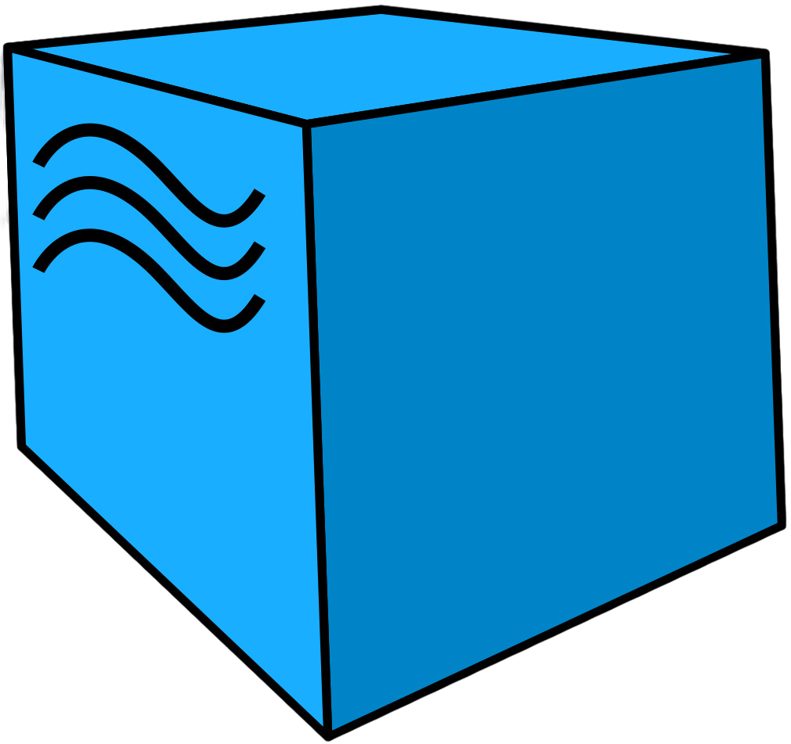

<h1 align="center">Hi there, I'm <a href="https://t.me/maxnvo89" target="_blank">Max</a> :vulcan_salute: </h1>
 QA engineer at <a href="https://urent.ru/" target="_blank">MTS Urent</a> and AQA (soon i'm hope) 😄
 Experience in manual QA since 2022
 Learning Automation QA since 2024
 Experience with frontend test automation frameworks like Selenium, Selene, Selenide, PyTest
 Experience with Mobile Testing - Android and iOS applications
 Experience with Python, HMTL/CSS. Base SQL knowledge.

## Autotests

  &nbsp
  &nbsp
  &nbsp
  &nbsp
  &nbsp
  &nbsp
  &nbsp
  &nbsp
  &nbsp
  &nbsp
  &nbsp
  &nbsp
  
  

## Testing of API and integrations

  &nbsp
  &nbsp
  &nbsp
  &nbsp
  &nbsp
  &nbsp
  

## Testing of Web and Mobile Applications

  &nbsp
  &nbsp
  &nbsp
  &nbsp
  &nbsp

## Logs and monitoring

  &nbsp
  &nbsp
  &nbsp
  &nbsp
  &nbsp

## Testing documentation
  

    &nbsp
    &nbsp
    &nbsp
    &nbsp
    &nbsp
    
  

## Work with databases 

  &nbsp
  &nbsp
  &nbsp
  &nbsp

## 📊 Statistics

<!-- Выбор темы ↑↑: https://github.com/anuraghazra/github-readme-stats/blob/master/themes/README.md --> 
<!-- Настройка отображения ↑↑: https://github.com/anuraghazra/github-readme-stats/ --> 

<!-- Выбор темы ↑↑: https://github.com/Ashutosh00710/github-readme-activity-graph/blob/main/THEMES.md --> 

 

<!--  Contacts section -->
## :anchor: Contact me :) 
<code></code>
<code></code>
